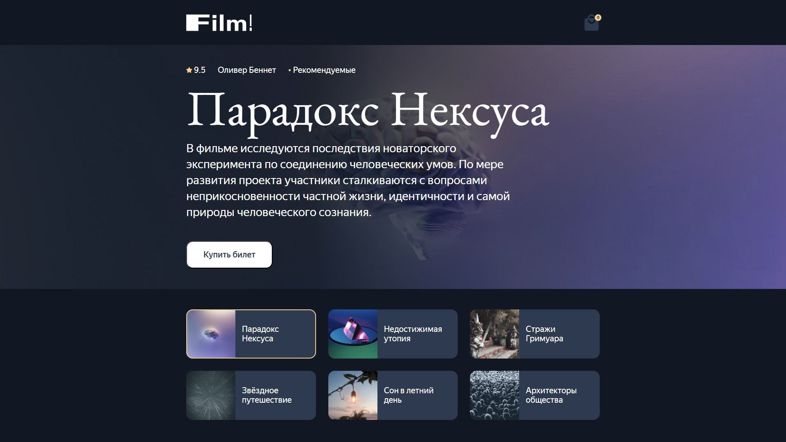
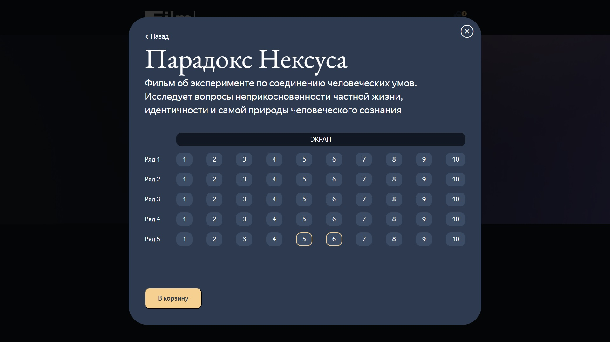
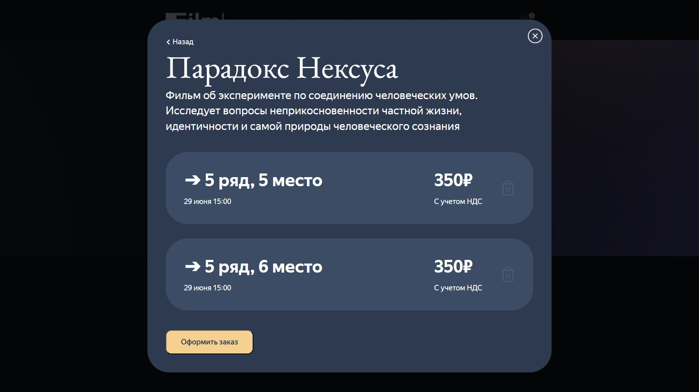
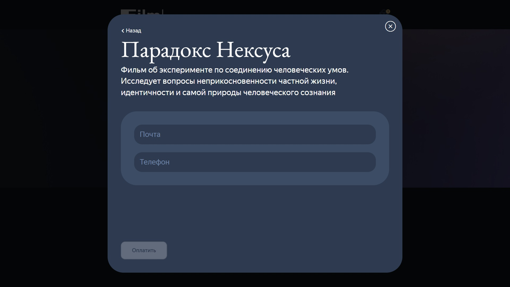
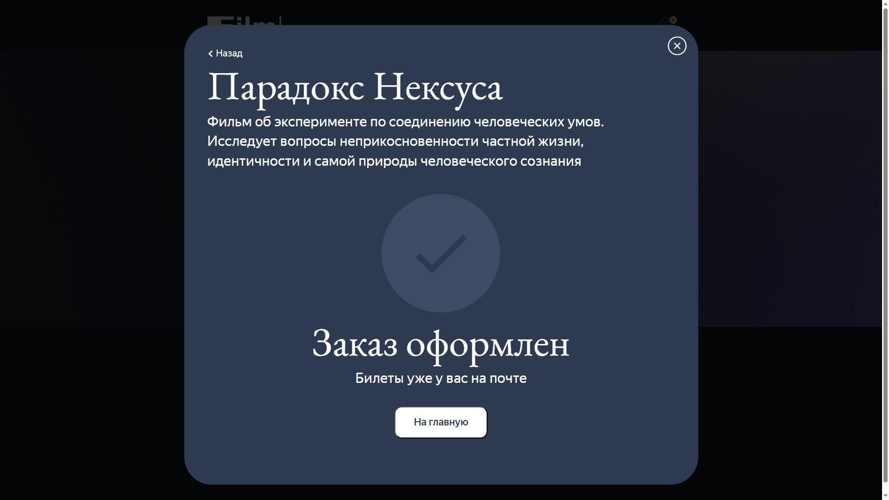
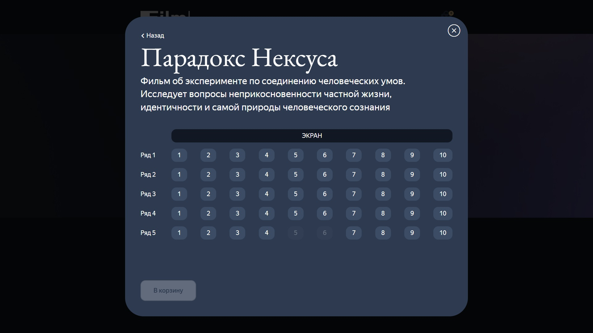

<div align="center">

# 🎬 Film!

**REST API для бронирования билетов в кинотеатр. Фильмы, сеансы, заказы — всё под контролем.**

[](https://github.com/MichaelPDRV/film-react-nest/actions)




</div>

---

## 📖 О проекте

**Film! API** — это полноценный бэкенд для онлайн-сервиса бронирования билетов в кинотеатр. Проект включает:

- 🎥 **Список фильмов** с афишей и расписанием сеансов.
- 🎫 **Бронирование билетов** с проверкой занятости мест (исключение двойных продаж).
- 📊 **Три формата логирования** (Dev, JSON, TSKV) с возможностью переключения через переменную окружения.
- 🐳 **Полная контейнеризация** через Docker и автоматический деплой через GitHub Actions.
- 🔄 **Поддержка двух СУБД**: MongoDB (Mongoose) и PostgreSQL (TypeORM) — выбор через переменную окружения.

---

## 🛠 Технологии

| Категория | Стек |
| :--- | :--- |
| **Фреймворк** | Nest.js, TypeScript |
| **База данных** | PostgreSQL (TypeORM) / MongoDB (Mongoose) — выбор через `.env` |
| **Логирование** | DevLogger (ConsoleLogger), JsonLogger, TskvLogger |
| **Тестирование** | Jest (unit-тесты контроллеров, сервисов и логгеров) |
| **Контейнеризация** | Docker, Docker Compose |
| **CI/CD** | GitHub Actions, GitHub Container Registry (GHCR) |
| **Веб-сервер** | Nginx (прокси для API и статики) |
| **Фронтенд** | React, Vite, TypeScript, Storybook |
| **Деплой** | Yandex Cloud (VPS) |

---

## ✨ Функциональность

| Раздел | Эндпоинт | Что делает |
| :--- | :--- | :--- |
| **Фильмы** | `GET /api/afisha/films/` | Список всех фильмов с сортировкой по рейтингу |
| **Расписание** | `GET /api/afisha/films/:id/schedule` | Сеансы конкретного фильма |
| **Бронирование** | `POST /api/afisha/order` | Бронирование билетов с проверкой занятых мест |
| **Статика** | `GET /content/afisha/*` | Раздача изображений и статических файлов |

---

## 🧠 Архитектурные решения

### Модульная структура (Nest.js)
```text
backend/src/
├── films/          # Контроллер, сервис, DTO для фильмов
├── order/          # Контроллер, сервис, DTO для заказов
├── repository/     # Интерфейс и реализации репозиториев
│   ├── films.repository.interface.ts
│   ├── films-mongodb.repository.ts
│   ├── films-postgresql.repository.ts
│   ├── entity/     # TypeORM-сущности (Film, Session)
│   └── film.schema.ts # Mongoose-схема
└── logger/         # Три реализации логгера
    ├── dev.logger.ts
    ├── json.logger.ts
    └── tskv.logger.ts
```

### Репозитории: абстракция над СУБД
- **Интерфейс `IFilmsRepository`** определяет методы: `getAllFilms`, `getFilmSchedule`, `findSessionById`, `updateSessionTaken`.
- **Две реализации**:
  - `FilmsRepositoryMongo` — Mongoose, вложенные документы.
  - `FilmsRepositoryPostgres` — TypeORM, связь one-to-many (`Film` → `Session`).
- **Выбор базы данных** через переменную `DATABASE_DRIVER` (`mongodb` / `postgres`).

### Логирование
- **DevLogger** — наследуется от `ConsoleLogger`, цветной вывод для разработки.
- **JsonLogger** — структурированные JSON-логи.
- **TskvLogger** — Tab-Separated Key-Value формат (экранирует `\t`, `\n`, `=`).
- Переключение через `LOGGER_TYPE` в `.env`.

### Бронирование с проверкой занятости
- При бронировании проверяется, что место не занято (`session.taken`).
- Запрещено бронирование одного места дважды в одном запросе (используется `Set`).
- При успехе список `taken` обновляется в БД.

---

## 🚀 Запуск проекта локально

### 1. Клонируйте репозиторий
```bash
git clone https://github.com/MichaelPDRV/film-react-nest.git
cd film-react-nest
```

### 2. Настройте переменные окружения
Создайте файл `.env` в корне проекта на основе `.env.example`:
```env
# Выбор СУБД: mongodb или postgres
DATABASE_DRIVER=postgres

# PostgreSQL
DATABASE_HOST=localhost
DATABASE_PORT=5432
DATABASE_USERNAME=prac
DATABASE_PASSWORD=prac
DATABASE_NAME=prac
DATABASE_SYNCHRONIZE=false

# ИЛИ MongoDB (закомментируйте PostgreSQL и раскомментируйте):
# DATABASE_DRIVER=mongodb
# DATABASE_URL=mongodb://localhost:27017/afisha

# Логирование: dev, json, tskv
LOGGER_TYPE=dev

# Для фронтенда (если запускаете отдельно)
VITE_API_URL=http://localhost:3000/api/afisha
VITE_CDN_URL=http://localhost:3000/content/afisha
```

### 3. Установите зависимости
```bash
# Бэкенд
cd backend
npm install

# Фронтенд (опционально, если нужен UI)
cd ../frontend
npm install
```

### 4. Запустите базу данных
**PostgreSQL (рекомендуемый вариант):**
```bash
docker run -d \
  --name postgres \
  -e POSTGRES_USER=prac \
  -e POSTGRES_PASSWORD=prac \
  -e POSTGRES_DB=prac \
  -p 5432:5432 \
  postgres:16.4
```
**MongoDB (альтернатива):**
```bash
docker run -d \
  --name mongodb \
  -p 27017:27017 \
  mongo
```

### 5. Запустите бэкенд
```bash
cd backend
npm run start:dev
```
Бэкенд будет доступен на [http://localhost:3000/api/afisha](http://localhost:3000/api/afisha).

### 6. Запустите фронтенд
```bash
cd frontend
npm run dev
```
Фронтенд будет доступен на [http://localhost:5173](http://localhost:5173).

---

## 📦 Скрипты

### Бэкенд (`backend/`)
| Команда | Описание |
| :--- | :--- |
| `npm start` | Запуск продакшен-версии (из `dist`) |
| `npm run start:dev` | Запуск в режиме разработки (watch) |
| `npm run start:debug` | Запуск с отладкой |
| `npm run build` | Сборка продакшен-версии в `dist` |
| `npm run test` | Запуск unit-тестов (Jest) |
| `npm run test:watch` | Запуск тестов в watch-режиме |
| `npm run test:cov` | Запуск тестов с покрытием |
| `npm run lint` | Проверка кода ESLint |

### Фронтенд (`frontend/`)
| Команда | Описание |
| :--- | :--- |
| `npm run dev` | Запуск dev-сервера (Vite) |
| `npm run build` | Сборка продакшен-версии |
| `npm run preview` | Предпросмотр собранного проекта |
| `npm run storybook` | Запуск Storybook |

---

## 🧪 Тестирование

### Unit-тесты (Jest)
```bash
cd backend
npm run test
```
**Покрыты:**
- Контроллеры (`films.controller.spec.ts`, `order.controller.spec.ts`)
- Сервисы (`films.service.spec.ts`, `order.service.spec.ts`)
- Логгеры (`json.logger.spec.ts`, `tskv.logger.spec.ts`)

Все тесты успешно проходят.

### E2E-тесты
```bash
npm run test:e2e
```

---

## 🐳 Деплой

### Docker
Проект полностью докеризирован:
- `backend/Dockerfile` — multi-stage сборка, финальный образ содержит только `dist` и production-зависимости.
- `frontend/Dockerfile` — сборка статики (Vite) на основе `node:22-alpine`.
- `nginx/Dockerfile` — проксирует запросы `/api/` и `/content/` к бэкенду, раздаёт статику фронтенда.

### Docker Compose
Файл `docker-compose.yml` объединяет все сервисы:

| Сервис | Контейнер | Порт (хост) | Описание |
| :--- | :--- | :--- | :--- |
| `database` | `postgres:16.4` | `5433:5432` | PostgreSQL для бэкенда |
| `pgadmin` | `dpage/pgadmin4` | `8080:80` | Админка для базы данных |
| `frontend` | (сборка из `frontend/`) | — | Собирает статику в volume |
| `backend` | (сборка из `backend/`) | `3000:3000` | Nest.js бэкенд |
| `server` | (сборка из `nginx/`) | `81:80` | Nginx с прокси и статикой |

**Запуск:**
```bash
docker-compose up -d --build
```

### CI/CD (GitHub Actions)
При пуше в основную ветку:
1. Собираются Docker-образы для бэкенда, фронтенда и Nginx.
2. Образы публикуются в GitHub Container Registry (GHCR).
3. Проект развёртывается на VPS (опционально — через SSH).

### Сервер
Проект развёрнут на VPS в Yandex Cloud. Доступен по адресу:  
🔗 [https://michaelpdrv-film.nomorepartiessbs.ru](https://michaelpdrv-film.nomorepartiessbs.ru)

---

## 📸 Скриншоты

<div align="center">
  <br/><br/>
  <br/><br/>
  <br/><br/>
  <br/><br/>
  <br/><br/>
  
</div>

---

## 📌 Что дальше
- [ ] Настроить HTTPS через Let's Encrypt.
- [ ] Добавить авторизацию и личный кабинет пользователя.
- [ ] Настроить автоматический деплой при пуше в `main`.

---

## 👨‍💻 Автор

**Michael PDRV**

[](https://github.com/MichaelPDRV)
[](https://t.me/michaelpdrv)

---

📌 **Лицензия**: Учебный проект, распространяется свободно.